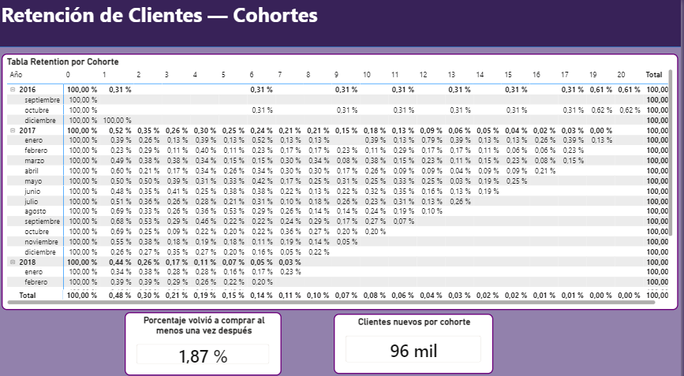
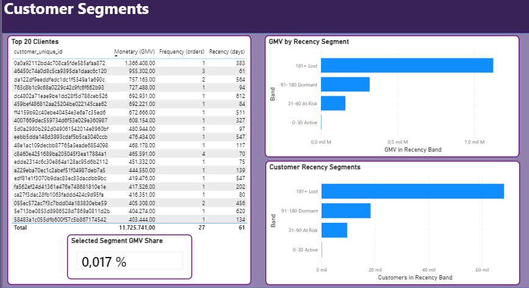

# E-commerce Growth & Retention (Power BI) | Olist Dataset

## Resumen
Proyecto de portfolio en Power BI para analizar un e-commerce de punta a punta: **crecimiento**, **retención (cohortes)**, **mix de categorías** y **segmentación de clientes (RFM)**.  
Incluye modelado en **esquema**, transformaciones en **Power Query** y medidas **DAX**.

## Ver dashboard (Power BI Service)
👉 **Link al reporte publicado:** https://app.powerbi.com/links/Tr_DaH2iPF?ctid=811b5463-d762-4cb5-9e0c-4f3f84c975cb&pbi_source=linkShare&bookmarkGuid=000f72d7-eb1c-4cd8-b9d8-3fd3d5a11b63  
> Nota: el archivo `.pbix` no se incluye en el repo (ver `powerbi/README.md`).

## Objetivo
Construir un dashboard ejecutivo y operativo que responda preguntas clave:
- ¿Cómo evolucionan pedidos, ventas (**GMV**) y ticket promedio (**AOV**) mes a mes?
- ¿Qué cohortes retienen mejor/peor y cómo cambia la recompra?
- ¿Cómo varía el **mix de categorías** en el tiempo y cuáles dominan el volumen?
- ¿Cómo se segmenta la base por **recencia/valor** para priorizar acciones (win-back, fidelización)?

## Dataset
**Olist Brazilian E-Commerce Public Dataset (Kaggle).**  
**Nota:** por buenas prácticas, los datos no se suben al repo. Descarga manual y colocación en `data_raw/`.

## KPIs principales
- **Orders:** cantidad de pedidos
- **Customers (unique):** clientes únicos
- **GMV:** suma de `payment_total`
- **AOV:** GMV / Orders
- **Returning Rate:** % de clientes que compran al menos una vez después de su primera compra
- **Retention % (Cohortes):** retención por mes desde la cohorte (M0, M1, M2…)

## Páginas del reporte
1. **Executive Overview**: KPIs, tendencia, categorías principales  
2. **Growth Drivers & Category Mix**: drivers de GMV, mix Top categorías en el tiempo  
3. **Retención y Recompra (Cohortes)**: matriz de cohortes, returning rate  
4. **Segmentación de Clientes (RFM)**: top customers, recency segments, GMV por segmento  

## Estructura del repositorio
- `powerbi/` → README con acceso al reporte (PBIX no incluido)
- `docs/` → brief, bitácora, documentación (diccionario y medidas)
- `images/` → capturas del dashboard para el README
- `data_raw/` → datos originales (ignorado por git)
- `data_processed/` → datos procesados (ignorado por git)
- `sql/` → carpeta reservada para scripts (opcional)

## Cómo reproducir (pasos)
1) Descargar el dataset Olist desde Kaggle y descomprimirlo en `data_raw/`  
2) Abrir el reporte desde el link publicado (Power BI Service)  
3) *(Opcional, si tenés PBIX local)* actualizar rutas/orígenes y refrescar el modelo  

## Capturas / Screenshots
*(Una vez que subas imágenes a `/images`, linkealas acá)*  
images/executive_overview.png
images/growth_drivers_mix.png.png
- 
- 
- 
- 

---

# English

## Overview
Power BI portfolio project to analyze an e-commerce business end-to-end: **growth**, **cohort retention**, **category mix**, and **customer segmentation (RFM)**.  
Includes **star schema modeling**, **Power Query** transformations, and **DAX** measures.

## Live report (Power BI Service)
👉 **Published report link:** https://app.powerbi.com/links/Tr_DaH2iPF?ctid=811b5463-d762-4cb5-9e0c-4f3f84c975cb&pbi_source=linkShare&bookmarkGuid=000f72d7-eb1c-4cd8-b9d8-3fd3d5a11b63 
> Note: `.pbix` is not committed to this repo (see `powerbi/README.md`).

## Goal
Build an executive + analytical dashboard to answer:
- How do Orders, **GMV**, and **AOV** evolve over time?
- Which cohorts retain better/worse and how repeat purchase changes?
- How does the **category mix** evolve and which categories dominate volume?
- How can we segment customers by **recency/value** to prioritize actions (win-back, loyalty)?

## Dataset
**Olist Brazilian E-Commerce Public Dataset (Kaggle).**  
**Note:** raw data is not committed. Manual download and placement under `data_raw/`.

## Key KPIs
- **Orders**
- **Customers (unique)**
- **GMV:** sum of `payment_total`
- **AOV:** GMV / Orders
- **Returning Rate:** % of customers who buy again at least once after their first purchase
- **Retention % (Cohorts):** retention by months since cohort (M0, M1, M2…)

## Report pages
1. **Executive Overview**  
2. **Growth Drivers & Category Mix**  
3. **Retention & Repurchase (Cohorts)**  
4. **Customer Segments (RFM)**  

## Repository structure
- `powerbi/` → README with access to the live report (PBIX not included)
- `docs/` → brief + decisions log + documentation
- `images/` → dashboard screenshots
- `data_raw/` → raw files (git ignored)
- `data_processed/` → processed files (git ignored)
- `sql/` → reserved folder (optional)

## Repro steps
1) Download Olist dataset from Kaggle and unzip into `data_raw/`
2) Open the report using the published link (Power BI Service)
3) *(Optional if you have a local PBIX)* update paths/sources and refresh

## Screenshots
images/executive_overview.png
images/growth_drivers_mix.png.png
images/retention_cohorts.png.png
images/customer_segments_rfm.png
