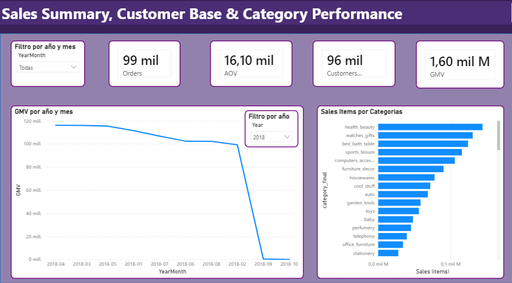
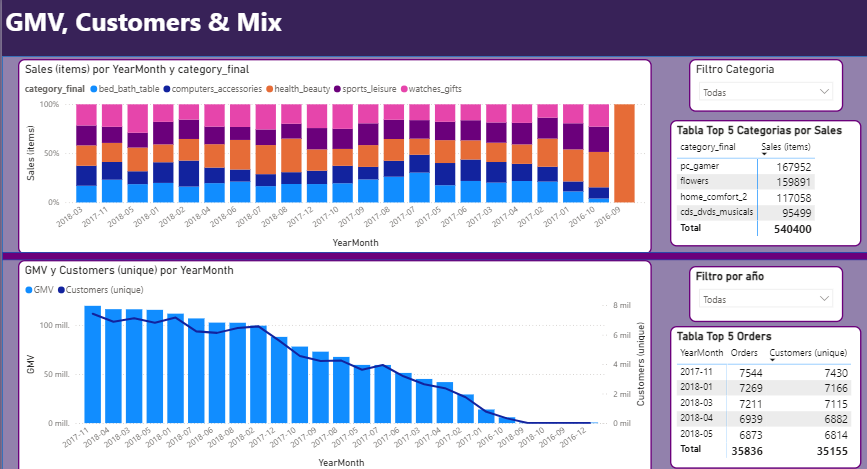
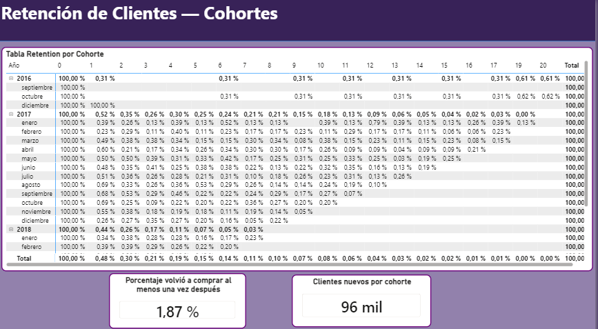
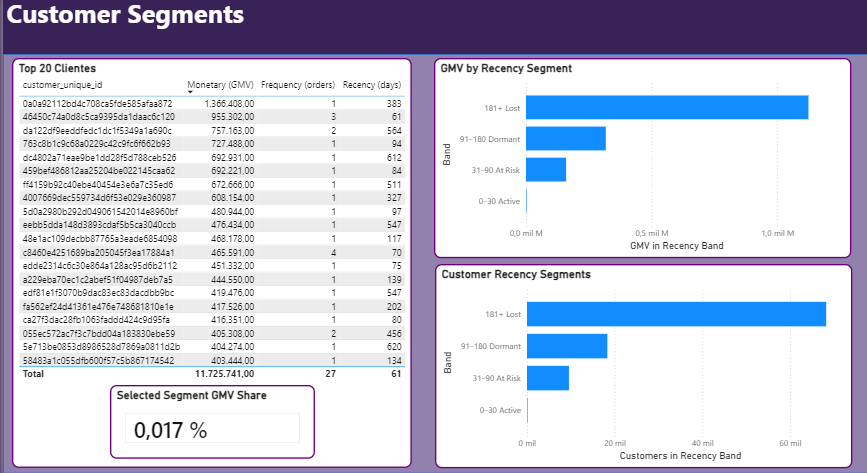

# E-commerce Growth & Retention (Power BI) | Olist Dataset

## Resumen

Proyecto de portfolio en Power BI para analizar un e-commerce de punta a punta: **crecimiento**, **retención por cohortes**, **mix de categorías** y **segmentación de clientes por valor y comportamiento de compra**.  
Incluye modelado en **esquema estrella**, transformaciones en **Power Query** y medidas **DAX**.

## Ver dashboard (Power BI Service)

👉 **Link al reporte publicado:** https://app.powerbi.com/links/Tr_DaH2iPF?ctid=811b5463-d762-4cb5-9e0c-4f3f84c975cb&pbi_source=linkShare&bookmarkGuid=000f72d7-eb1c-4cd8-b9d8-3fd3d5a11b63

> Nota: el archivo `.pbix` no se incluye en el repo (ver `powerbi/README.md`).

## Objetivo

Construir un dashboard ejecutivo y operativo que responda preguntas clave:

* ¿Cómo evolucionan pedidos, ventas (**GMV**) y ticket promedio (**AOV**) mes a mes?
* ¿Qué cohortes retienen mejor/peor y cómo cambia la recompra?
* ¿Cómo varía el **mix de categorías** en el tiempo y cuáles dominan el volumen?
* ¿Cómo se segmenta la base de clientes por valor y comportamiento para priorizar acciones de retención y recuperación?

## Dataset

**Olist Brazilian E-Commerce Public Dataset (Kaggle).**  
**Nota:** por buenas prácticas, los datos no se suben al repo. Descarga manual y colocación en `data_raw/`.

## KPIs principales

* **Orders:** cantidad de pedidos
* **Customers (unique):** clientes únicos
* **GMV:** suma de `payment_total`
* **AOV:** GMV / Orders
* **Returning Rate:** % de clientes que compran al menos una vez después de su primera compra
* **Retention % (Cohortes):** retención por mes desde la cohorte (M0, M1, M2…)

## Páginas del reporte

1. **Executive Overview**: KPIs, tendencia, categorías principales
2. **Growth Drivers & Category Mix**: drivers de GMV, mix Top categorías en el tiempo
3. **Retención y Recompra (Cohortes)**: matriz de cohortes, returning rate
4. **Segmentación de Clientes**: análisis por valor, recencia y comportamiento de compra

## Estructura del repositorio

* `powerbi/` → README con acceso al reporte (PBIX no incluido)
* `docs/` → brief, bitácora, documentación (diccionario y medidas)
* `images/` → capturas del dashboard
* `data_raw/` → datos originales (ignorado por git)
* `data_processed/` → datos procesados (ignorado por git)
* `sql/` → carpeta reservada para scripts (opcional)

## Documentación

* [Project brief](docs/00_brief.md)
* [Data dictionary](docs/data_dictionary.md)
* [DAX measures](docs/dax_measures.md)
* [Bitácora de decisiones](docs/bitacora_decisiones.md)

## Cómo reproducir

1. Descargar el dataset Olist desde Kaggle y descomprimirlo en `data_raw/`
2. Abrir el reporte desde el link publicado (Power BI Service)
3. *(Opcional, si tenés PBIX local)* actualizar rutas/orígenes y refrescar el modelo

## Capturas

### Executive Overview

### Growth Drivers & Category Mix

### Retención y Recompra (Cohortes)

### Segmentación de Clientes

---

# English

## Overview

Power BI portfolio project to analyze an e-commerce business end-to-end: **growth**, **cohort retention**, **category mix**, and **customer segmentation by value and purchase behavior**.  
Includes **star schema modeling**, **Power Query** transformations, and **DAX** measures.

## Live report (Power BI Service)

👉 **Published report link:** https://app.powerbi.com/links/Tr_DaH2iPF?ctid=811b5463-d762-4cb5-9e0c-4f3f84c975cb&pbi_source=linkShare&bookmarkGuid=000f72d7-eb1c-4cd8-b9d8-3fd3d5a11b63

> Note: `.pbix` is not committed to this repo (see `powerbi/README.md`).

## Goal

Build an executive and analytical dashboard to answer:

* How do Orders, **GMV**, and **AOV** evolve over time?
* Which cohorts retain better/worse and how does repeat purchase change?
* How does the **category mix** evolve and which categories dominate volume?
* How can we segment customers by value and behavior to prioritize retention and win-back actions?

## Dataset

**Olist Brazilian E-Commerce Public Dataset (Kaggle).**  
**Note:** raw data is not committed. Manual download and placement under `data_raw/`.

## Key KPIs

* **Orders**
* **Customers (unique)**
* **GMV:** sum of `payment_total`
* **AOV:** GMV / Orders
* **Returning Rate:** % of customers who buy again at least once after their first purchase
* **Retention % (Cohorts):** retention by months since cohort (M0, M1, M2…)

## Report pages

1. **Executive Overview**
2. **Growth Drivers & Category Mix**
3. **Retention & Repurchase (Cohorts)**
4. **Customer Segmentation**: analysis by value, recency and purchase behavior

## Repository structure

* `powerbi/` → README with access to the live report (PBIX not included)
* `docs/` → brief, decisions log, documentation
* `images/` → dashboard screenshots
* `data_raw/` → raw files (git ignored)
* `data_processed/` → processed files (git ignored)
* `sql/` → reserved folder (optional)

## Repro steps

1. Download Olist dataset from Kaggle and unzip into `data_raw/`
2. Open the report using the published link (Power BI Service)
3. *(Optional if you have a local PBIX)* update paths/sources and refresh

## Screenshots

### Executive Overview

### Growth Drivers & Category Mix

### Retention & Repurchase (Cohorts)

### Customer Segmentation

